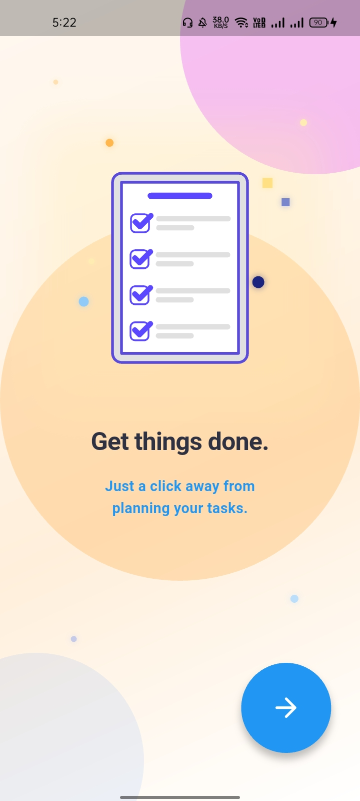
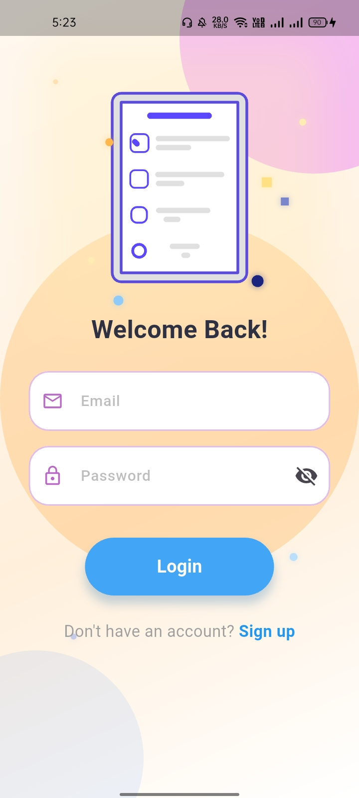
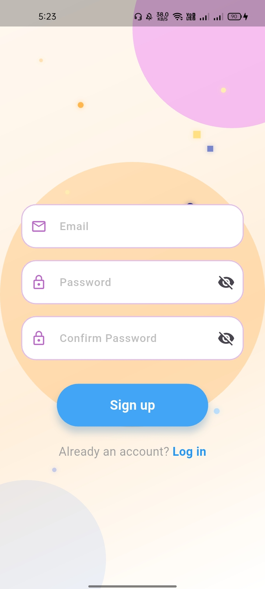
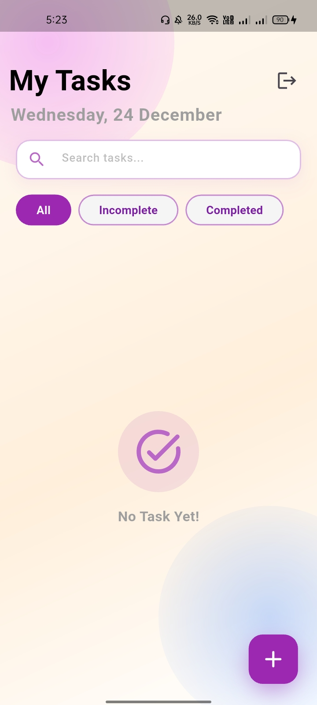
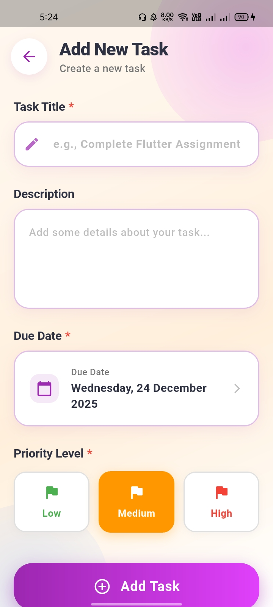
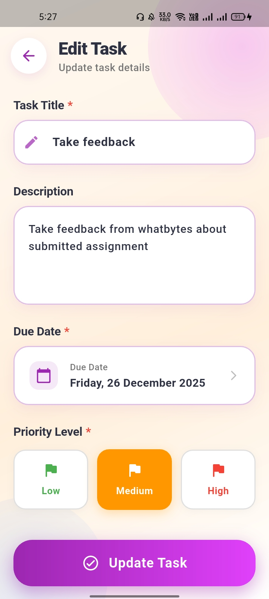

# Gig Worker Task Management App - Whatbytes Assignment

## Features
- Beautiful onboarding with Lottie animation and smooth Hero transition
- Firebase Email/Password Authentication (Login + Register)
- Real-time task management with Cloud Firestore
- Add, Edit, Delete, Complete tasks
- Tasks sorted by due date (earliest first)
- Priority levels (Low/Medium/High) with color indicators
- Responsive & premium UI with gradients, custom checkboxes
- Proper auth flow (logged in → direct home)

## Tech Stack
- Flutter
- GetX for state management & routing
- Firebase Auth + Cloud Firestore
- Lottie for animations

## Setup
1. FlutterFire configure 
2. flutter pub get
3. flutter run

## Screenshots

### Onboarding

### Login

### Register

### Home

### Add Task

### Added Task List

### Edit Task

